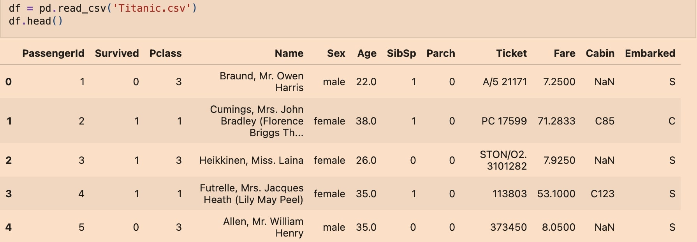
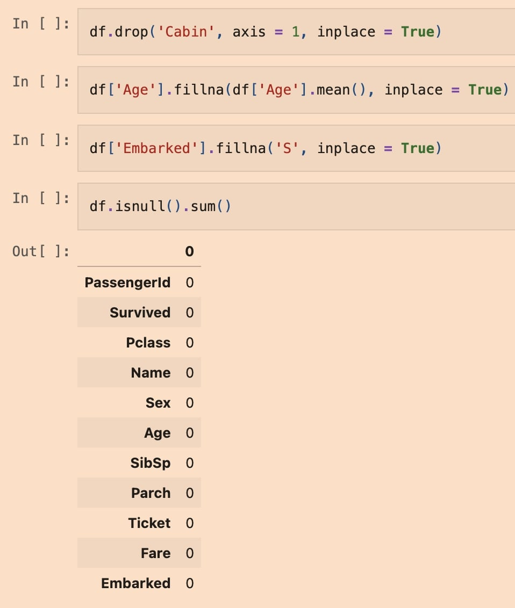
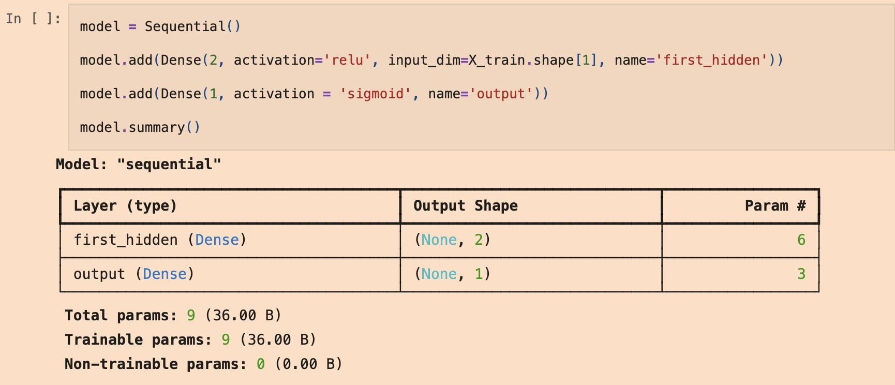
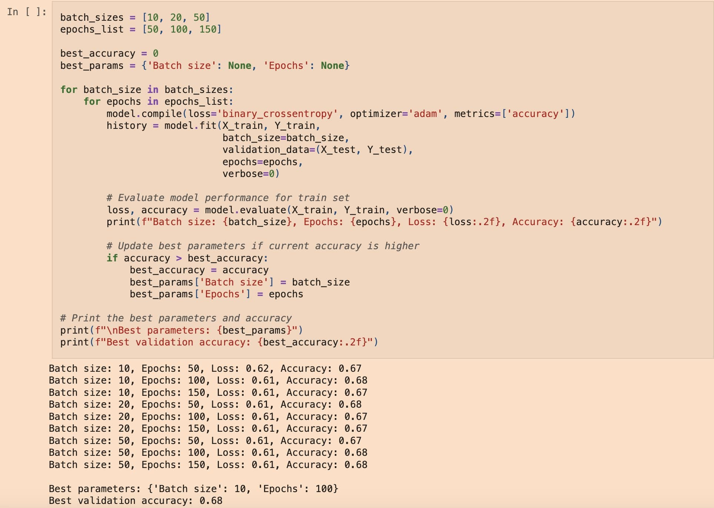
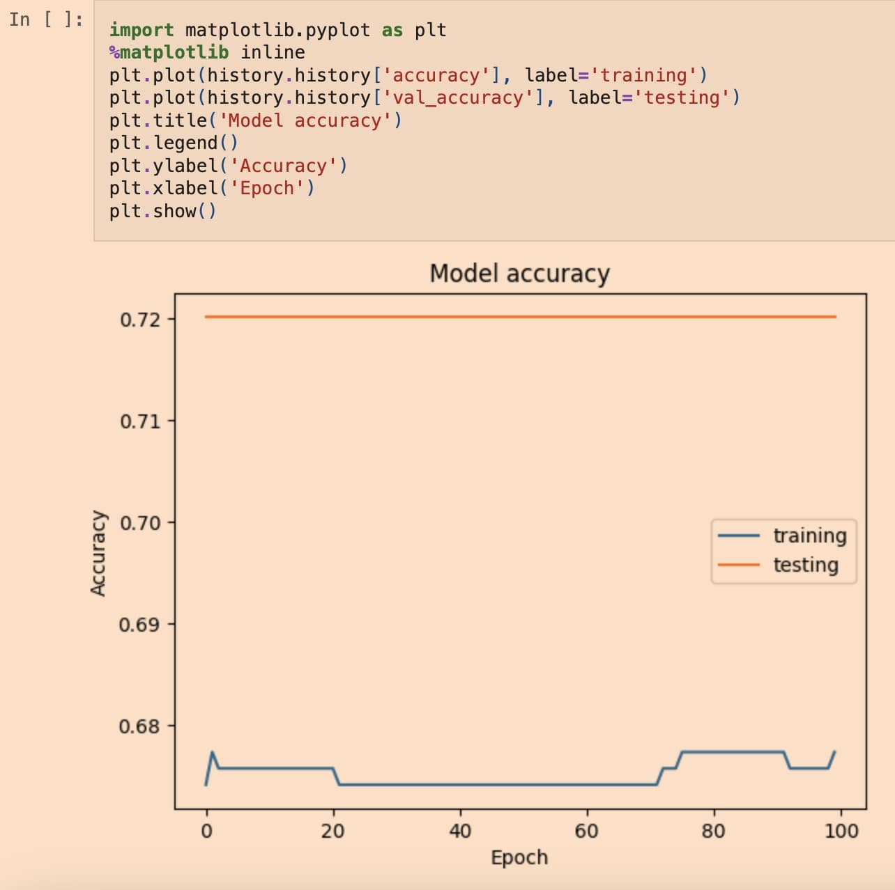
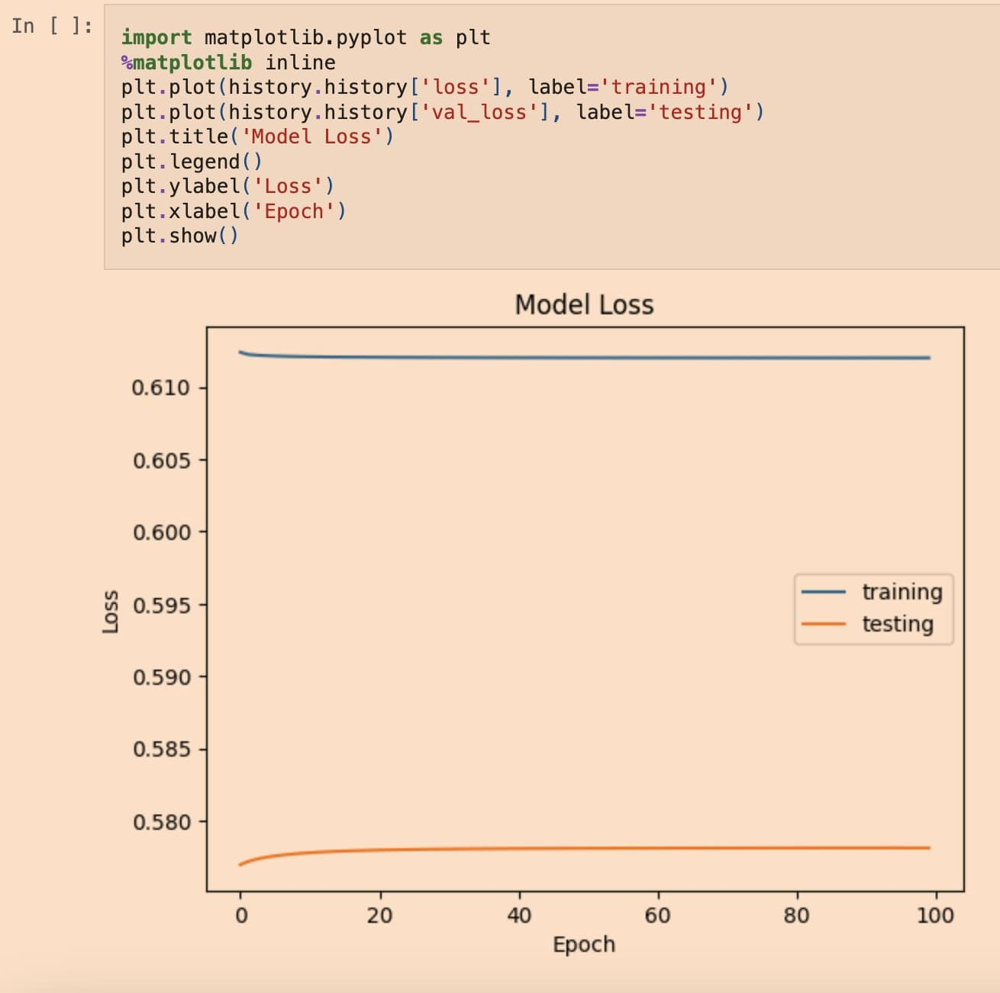

# Neural Networks Project using Titanic.csv Dataset
<a href="Andrew_Garcia_Neural_Networks_Project_1.ipynb" download>View Jupyter Project File</a>

### Project Overview
This project utilizes a neural network to analyze the Titanic dataset provided, predicting passenger survival based on various attributes. The dataset includes features such as __survival status, passenger class, gender, age, and fare__, among others. The workflow involves data loading, preprocessing, model training and performance evaluation.

__Tool 1__: Data Loading and Exploration
Necessary libraries such as pandas and matplotlib are imported, and the Titanic dataset (Titanic.csv) is uploaded into df and copied as df1 for purposes of analyzing. The first five rows are displayed to inspect the variables. Null values are also checked and are either removed or filled in. 

__Tool 2__: Data Visualization and Training
The data is split into train and test sets that will be used in defining the model architecture and determining the number of epochs and batch sizes to create model accuracy and loss. A for-loop is used for the batch sizes and epochs to run through every scenario with the greatest accuracy.

__Tool 3__: Model Compilation and Employing a Neural Network

A list of batch sizes include: 10, 20, and 50. More sizes were tested to ensure the highest accuracy.
A list of epoch counts include: 50, 100, and 150. More epoch counts were tested to ensure the highest accuracy. 

The code also prints out the best parameters in batch sizes and epochs along with the greatest accuracy.

### Results

__Accuracy Plot__: Illustrated training and validation accuracy trends, indiciating model learning behavior.

__Loss Plot__: Showed training and validation loss, providing insights into model optimization and potential overfitting in the dataset.

__Skills Demonstrated__:
* Data Processing and exploration with pandas.
* Neural network implementation and evaluation.
* Visualization of model performance using matplotlib.

